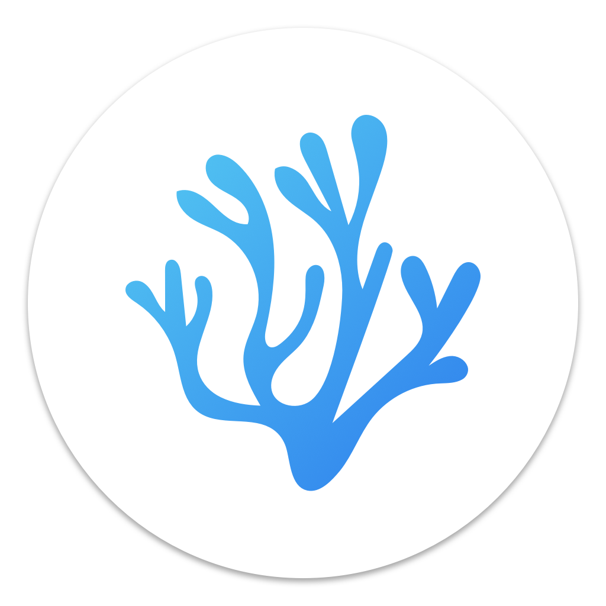

# Hi, there! 

### Technologies
&nbsp;
&nbsp;

&nbsp;
&nbsp;
![Actix-Web](https://img.shields.io/badge/-Actix-web?color=e98ef5&style=plastic&logo=data:image/png;base64,iVBORw0KGgoAAAANSUhEUgAAABQAAAAUCAMAAAC6V+0/AAABdGlDQ1BpY2MAACiRdZG7SwNBEIc/o8E3EWJhYRFFrRKJCkEbwYioECTECL6a5HJJhDyOu4iIrWArKIg2vgr9C7QVrAVBUQSxsLJWtNFwziWBBDG77M63v50ZZmfBFk4paaPOC+lMTg9N+l3zC4uu+lfsNMrswhlRDG0sGAxQdXw9UGPZO4+Vq7rfv6M5phoK1DQIjyqanhOeEg6s5TSLd4XblWQkJnwu7NalQOF7S48W+c3iRJF/LNbDoXGwtQm7EhUcrWAlqaeF5eX0pFOrSqke6yUtamZuVmy3rE4MQkzix8U0E4zjY4AR2X14GKRfTlSJ9xbiZ8hKrCK7xjo6KyRIksMt6qpkV8XGRVdlpli3+v+3r0Z8aLCYvcUP9hfT/OiF+h3Ib5vm97Fp5k+g9hmuMuX47BEMf4q+XdZ6DsGxCRfXZS26B5db0PGkRfRIQaqVZYvH4f0MWhfAeQtNS8Wele45fYTwhnzVDewfQJ/4O5Z/ARPZZ8AYzvYNAAAAIGNIUk0AAHomAACAhAAA+gAAAIDoAAB1MAAA6mAAADqYAAAXcJy6UTwAAAHOUExURQAAAAgGBQgGBQgGBQgGBQgGBQgGBQgGBQgGBQgGBQgGBQgGBQgGBQgGBQgGBQgGBQgGBQgGBQgGBQgGBQgGBQgGBQgGBQgGBQgGBQgGBQgGBQgGBQgGBQgGBQgGBQgGBQgGBQgGBQgGBQgGBQgGBQgGBQgGBQgGBQgGBQgGBQgGBQgGBQgGBQgGBQgGBQgGBQgGBQgGBQgGBQgGBQgGBQgGBQgGBQgGBQgGBQgGBQgGBQgGBQgGBQgGBQgGBQgGBQgGBQgGBQgGBQgGBQgGBQgGBQgGBQgGBQgGBQgGBQgGBQgGBQgGBQgGBQgGBQgGBQgGBQgGBQgGBQgGBQgGBQgGBQgGBQgGBQgGBQgGBQgGBQgGBQgGBQgGBQgGBQgGBQgGBQgGBQgGBQgGBQgGBQgGBQgGBQgGBQgGBQgGBQgGBQgGBQgGBQgGBQgGBQgGBQgGBQgGBQgGBQgGBQgGBQgGBQgGBQgGBQgGBQgGBQgGBQgGBQgGBQgGBQgGBQgGBQgGBQgGBQgGBQgGBQgGBQgGBQgGBQgGBQgGBQgGBQgGBQgGBQgGBQgGBQgGBQgGBQgGBQgGBQgGBQgGBQgGBQgGBQgGBQgGBQgGBf///ykDMiwAAACYdFJOUwAADiNDV0w1HwQGPYrEzMXDv6RoAxFvx7diLRobM4DXpTkHC3jedgyouTtN5ZEwnpD3nyEVsH0FIm7az4vk615K6OKimXKHruD1dymmqhYCcP7C/WPmRMaG/KuO2PiF4yfIQtmb8p0BPnXSFwiEWW3hNN9F7zGCFBzOyWlTbCwJmCAPfzh0mkHdVC6B1L7sCtb56nwkUlxG0vPQrwAAAAFiS0dEmQHWNqgAAAAJcEhZcwAALiMAAC4jAXilP3YAAAAHdElNRQfnAg4JJyXDmvhkAAABuHpUWHRSYXcgcHJvZmlsZSB0eXBlIGljYwAAOI2dU1my4yAM/OcUcwSh1RzHZqma+19gBMKZJJX3kacqjN0SUtOS099a059pUjTBNBTWqqTNCJgWpE27saEgGyOCHFLkRADr/gDxVWJhBsiUNCsZGXAW93KFX9jwqpNRvoFG2B7MvrT0ZfylrGKkUSjDETD15BcDQ+Nw8HZwNXOF4MZL7B7gfA+XY+PnjseaXM4lYzja/wMveD8euD3jo974TMTemaCKt1wIfuAz/kN8mlQNtcX3rTGyN6Ka6Lvo98mqol1Eth9xi52d4uyU+Iy4NMA4q/juc8I+M5MBqS9PRGW/+0InQDO2p3CuAfyCwR02CXD30yNF5ZlAh7Pyd/OK5qD6rg6oCz27hzViTYK9yj6rMz4FsNa8Xnn8Ck82JxfeBtdnSYnoERiTXTkAaX1MI5T1bWXdYbQCC7/OvPa2K1Fb7a+gPX1ioCPGhI4RCV3fT3HIZQTlg1fXLq30MSEWW3471p6P5oBmH5f8FEb31VB1CuaJ8bQQQco6SDFecMr1Mm+vrYOTmi1GwnbNnWtdgaWUdTfcBWBITf8Aj6b/NugjLKwAAAAldEVYdGRhdGU6Y3JlYXRlADIwMjMtMDItMTRUMDk6Mzg6MzIrMDA6MDAGd3BQAAAAJXRFWHRkYXRlOm1vZGlmeQAyMDIzLTAyLTE0VDA5OjM4OjMyKzAwOjAwdyrI7AAAACZ0RVh0aWNjOmNvcHlyaWdodABObyBjb3B5cmlnaHQsIHVzZSBmcmVlbHmnmvCCAAAAIXRFWHRpY2M6ZGVzY3JpcHRpb24Ac1JHQiBJRUM2MTk2Ni0yLjFXrdpHAAAAL3RFWHRDb21tZW50AEdJRiByZXNpemVkIG9uIGh0dHBzOi8vZXpnaWYuY29tL3Jlc2l6ZaI7uLIAAAASdEVYdFNvZnR3YXJlAGV6Z2lmLmNvbaDDs1gAAAFOSURBVBjTY2BgYGBEBgwQAGIyMbOwsrFzcMJEgTQXNw8vH7+AoJAwhwhYFCgmKiYuISklLSMrJ6+gqAQSZWRUVlFVU4cYqDFDUwuklpFRW0cXaomevoGhkTFI0MR0hhlIxNzC0sraxtbO3hwo6ODo5OziKubm7jFjhqeXt4+vHyODf0BgkFfwjBnWIWqhM3T9GcPCFRkZRCIio6JjZsSyMTLGxScwMiYkJjEymNskyzBapKQ6AAXT0hkZvcUzgGZmZmUzMubkBuXlF+QB7QvjLwQKJhUVA9lKLoEzSkqBjLKobKBguYQv0BeMFZUzbC0YGY2rqv2Bgv41Ovkgd9ZG2tYx1jdINIJ91NSsE1DPyNhi1Bqh2FbVbg7xvElrh2lnV3dPb2SfYLsSJPAYGfuTnCeopk6cxDt5ijksmIEG9ktNtZ82vVEEEfQM6NEBAKtQRJ3NTN1zAAAAAElFTkSuQmCC&logoColor=blue)

&nbsp;

### Misc:
* Software:

---

<!--  **ren-chon/ren-chon** is a ✨ _special_ ✨ repository because its `README.md` (this file) appears on your GitHub profile. -->
